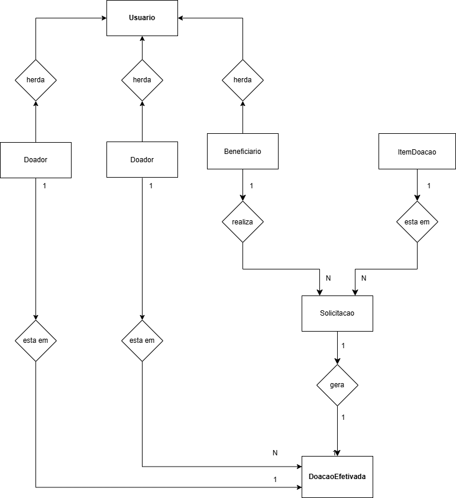

# Rede Solidária de Doação e Reaproveitamento

## Descrição

O objetivo desse projeto é Construir uma aplicação orientada a objetos em Java que simule uma plataforma de doações, com foco em organização, regras de negócio e responsabilidade social.

Onde muitas pessoas e organizações têm itens em bom estado que poderiam ser reaproveitados, mas faltam organização, priorização e rastreabilidade. Ao mesmo tempo, famílias, ONGs e comunidades precisam de roupas, alimentos não perecíveis, materiais escolares, móveis e itens básicos. A proposta é que o sistema permita:

- cadastrar doadores e beneficiários,
- registrar itens para doação,
- classificar necessidades prioritárias,
- controlar solicitações,
- acompanhar status da doação até a entrega.


O projeto irá demonstrar aplicação prática dos conceitos de Programação Orientada a Objetos e contribuir com reflexões sobre os Objetivos de Desenvolvimento Sustentável, especialmente redução das desigualdades e consumo responsável alinhados com ODS:  
- ODS 1 - Erradicação da Pobreza
- ODS 2 - Fome Zero e Agricultura Sustentável
- ODS 10 - Redução das Desigualdades
- ODS 12 - Consumo e Produção Responsáveis.
---

## Como Executar

**Pré-requisitos:** Java 21 instalado.

**Compilar:**
```bash
javac -d bin src/model/*.java src/repository/*.java src/middleware/*.java src/exception/*.java src/service/*.java src/util/*.java src/Main.java
```

**Executar:**
```bash
java -cp bin Main
```
---

## Funcionalidades Implementadas

- cadastro de doadores;
- cadastro de beneficiários;
- cadastro de itens para doação;
- listagem de doadores, beneficiários e itens;
- filtro de itens por categoria e status;
- criação de solicitações;
- listagem e filtro de solicitações por status;
- atualização de status da solicitação;
- controle de estoque e status do item.

---

## 2º Checkpoint - Regras de Negócio

Nesta etapa foram implementadas as principais regras de negócio do sistema:

- **solicitação de item**
  - beneficiário seleciona um item disponível;
  - informa quantidade, justificativa e data da solicitação.

- **validações**
  - campos obrigatórios;
  - quantidade maior que zero;
  - item existente e disponível;
  - quantidade solicitada compatível com o estoque;
  - opções válidas para tipo de doador, tipo de beneficiário, prioridade, categoria, conservação e status.

- **mudança de status**
  - `Pendente -> Aprovada`;
  - `Pendente -> Recusada`;
  - `Pendente -> Cancelada`;
  - `Aprovada -> Concluida`.

- **listagens e filtros**
  - itens disponíveis;
  - itens por categoria e status;
  - solicitações por status.

- **tratamento de erros de entrada**
  - leitura segura de números inteiros;
  - mensagens de erro para entradas inválidas;
  - exceção própria para regras de negócio.

---

## Modelagem
<div align="center">
  <p><i>Modelagem de Classes</i></p>
  
</div>

<div align="center">
  <p><i>Diagrama de Classes</i></p>
  
</div>

## Tecnologias Utilizadas
Java (Versão 21.0.10).

Versionamento: Git & GitHub.

IDE: IntelliJ IDEA.

Modelagem: Draw.io. 

Estrutura do Projeto: 
```
src/
├─ model/
├─ middleware/
├─ exception/
├─ service/
├─ repository/
├─ util/
└─ Main.java
```

