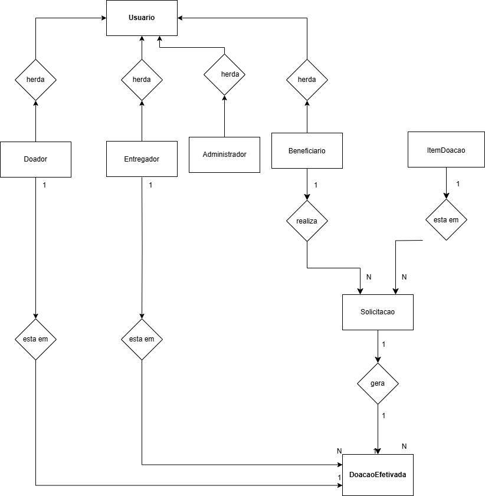

# Rede Solidária de Doação e Reaproveitamento

## Descrição

O objetivo desse projeto é Construir uma aplicação orientada a objetos em Java que simule uma plataforma de doações, com foco em organização, regras de negócio e responsabilidade social.

Onde muitas pessoas e organizações têm itens em bom estado que poderiam ser reaproveitados, mas faltam organização, priorização e rastreabilidade. Ao mesmo tempo, famílias, ONGs e comunidades precisam de roupas, alimentos não perecíveis, materiais escolares, móveis e itens básicos. A proposta é que o sistema permita:

- cadastrar doadores e beneficiários,
- registrar itens para doação,
- classificar necessidades prioritárias,
- controlar solicitações,
- acompanhar status da doação até a entrega.


O projeto irá demonstrar aplicação prática dos conceitos de Programação Orientada a Objetos e contribuir com reflexões sobre os Objetivos de Desenvolvimento Sustentável, especialmente redução das desigualdades e consumo responsável alinhados com ODS:  
- ODS 1 - Erradicação da Pobreza
- ODS 2 - Fome Zero e Agricultura Sustentável
- ODS 10 - Redução das Desigualdades
- ODS 12 - Consumo e Produção Responsáveis.
---

## Como Executar

**Pré-requisitos:** Java 21 instalado.

**Compilar:**
```bash
javac -d bin src/model/*.java src/service/*.java src/util/*.java src/Main.java
```

**Executar:**
```bash
java -cp bin Main
```
---

## Modelagem
<div align="center">
  <p><i>Modelagem de Classes</i></p>
  
</div>

<div align="center">
  <p><i>Diagrama de Classes</i></p>
  
</div>

## Tecnologias Utilizadas
Java (Versão 21.0.10).

Versionamento: Git & GitHub.

IDE: IntelliJ IDEA.

Modelagem: Draw.io. 

Estrutura do Projeto: 
```
src/
├─ model/
├─ service/
├─ repository/
├─ util/
└─ Main/ 
```

